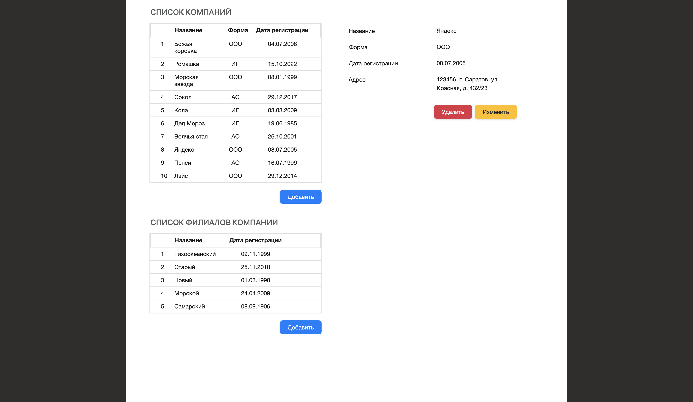
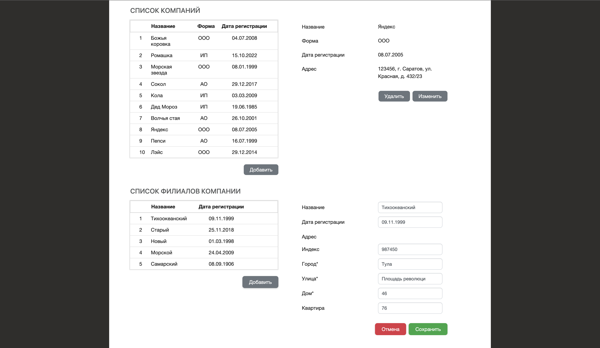

# demo project #

#### technology stack ####

ZK CE (MVVM) + Wildfly + Jakarta EE9.1 + Hibernate + Liquibase + Gradle + Docker

#### How do I get set up? ####
```
gradle build
docker-compose up

and go to http://localhost:8080/zk/demo.zul
```
#### Result ####

